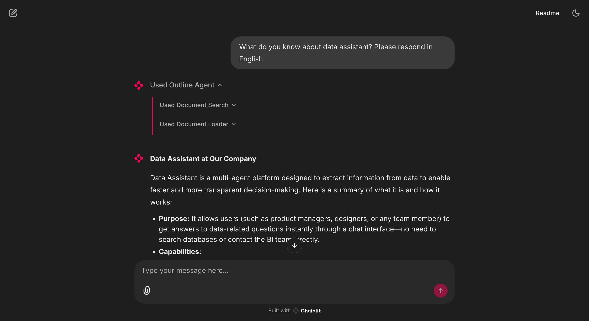

# Chainlit and Outline Integration

[](https://github.com/mkay1375/chainlit-and-outline/actions/workflows/main.yml?query=branch%3Amain)
[](https://img.shields.io/github/commit-activity/m/mkay1375/chainlit-and-outline)
[](https://img.shields.io/github/license/mkay1375/chainlit-and-outline)

A [Chainlit](https://chainlit.io) AI chat application integrated with [Outline](https://www.getoutline.com).

Using this project you can ask about your documents in Outline like "What do you know about topic X?",
or "Can you summarize this doc? (Link of the doc)":



## Prerequisites

- Python 3.9 or higher
- uv package manager
- Git
- Make

## Quick Start

1. Clone the repository:
   ```bash
   git clone https://github.com/mkay1375/chainlit-and-outline.git
   cd chainlit-and-outline
   ```

2. Install dependencies using uv:
   ```bash
   make install
   ```

3. Create a `.env` file in the project root with your configuration:
   ```bash
   cp .env.example .env
   ```

4. Update the `.env` file with your settings:
   ```env
   OUTLINE_API_KEY=your_outline_api_key
   OUTLINE_API_URL=your_outline_api_url
   OPENAI_API_KEY=your_open_ai_api_key
   ```

5. Start the development server:
   ```bash
   make up
   ```

The application will be available at `http://localhost:8000`

## Development

To ensure code quality, the project uses pre-commit hooks. Run them manually with:
```bash
make check
```

## License

This project is licensed under the terms of the license included in the repository.

---

Repository initiated with [fpgmaas/cookiecutter-uv](https://github.com/fpgmaas/cookiecutter-uv).
